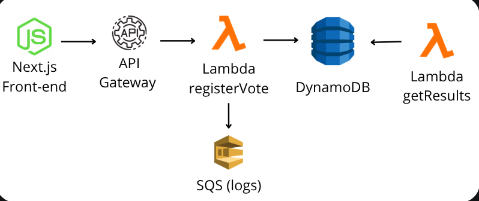

# Sistema de Votação Serverless – Next.js + AWS

Este projeto implementa um sistema de votação totalmente **serverless**, utilizando Next.js no front‑end e vários serviços AWS no backend: Lambda, API Gateway, DynamoDB, SQS e CloudWatch Logs.

---

## 🚀 Tecnologias Utilizadas

### **Frontend**

- Next.js 14 (App Router)
- React
- TailwindCSS (se aplicável)

### **Backend (AWS)**

- **API Gateway** – Entrada HTTP
- **AWS Lambda** – Processamento dos votos e consulta dos resultados
- **DynamoDB** – Armazenamento NoSQL dos votos
- **SQS** – Log assíncrono dos votos
- **CloudWatch Logs** – Monitoramento e depuração

---

## 🏗 Arquitetura da Solução



---

## 📦 Instalação do Projeto

Clone o repositório e instale as dependências:

```bash
git clone <seu-repo>
cd voting-app
npm install
```

---

## ⚙️ Configuração do Ambiente

Crie o arquivo `.env.local` na raiz do projeto e defina a URL da sua API Gateway:

```bash
NEXT_PUBLIC_API_GATEWAY_URL=https://SEU-ENDPOINT.execute-api.REGIAO.amazonaws.com

```

Substitua `SEU-ENDPOINT` e `REGIAO` pelos valores correspondentes do seu API Gateway.

---

## ▶️ Rodando o Projeto

```bash
npm run dev
```

Acesse em:

```
http://localhost:3000
```

---

## 🧪 Funcionamento da API

### **Registrar voto**

```bash
POST /vote
{
  "option": "A" | "B"
}
```

### **Consultar resultados**

```bash
GET /results
```

---

## 📂 Estrutura de Pastas

```
voting-app/
│── app/
│   ├── page.tsx
│── public/
│── .env.local
│── package.json
│── README.md
```

---

## ☁️ Infraestrutura AWS via CLI

As principais etapas foram:

- Criar tabela DynamoDB
- Criar IAM Role para Lambdas
- Criar funções Lambda (registerVote e getResults)
- Criar API Gateway e rotas
- Criar fila SQS e vincular Lambda de logs
- Monitorar via CloudWatch Logs

Todo o provisionamento foi feito em **CLI**.

---

## 🎯 Conclusão

Este projeto demonstra uma arquitetura moderna, serverless, escalável e barata, integrando múltiplos serviços AWS e um front-end React/Next.js.

Perfeito para uso acadêmico, demonstração de conhecimento ou portfolio profissional.

---

## 🧑‍💻 Autores

- **Renan Teixeira**
- **Rodrigo Rodrigues**

---
